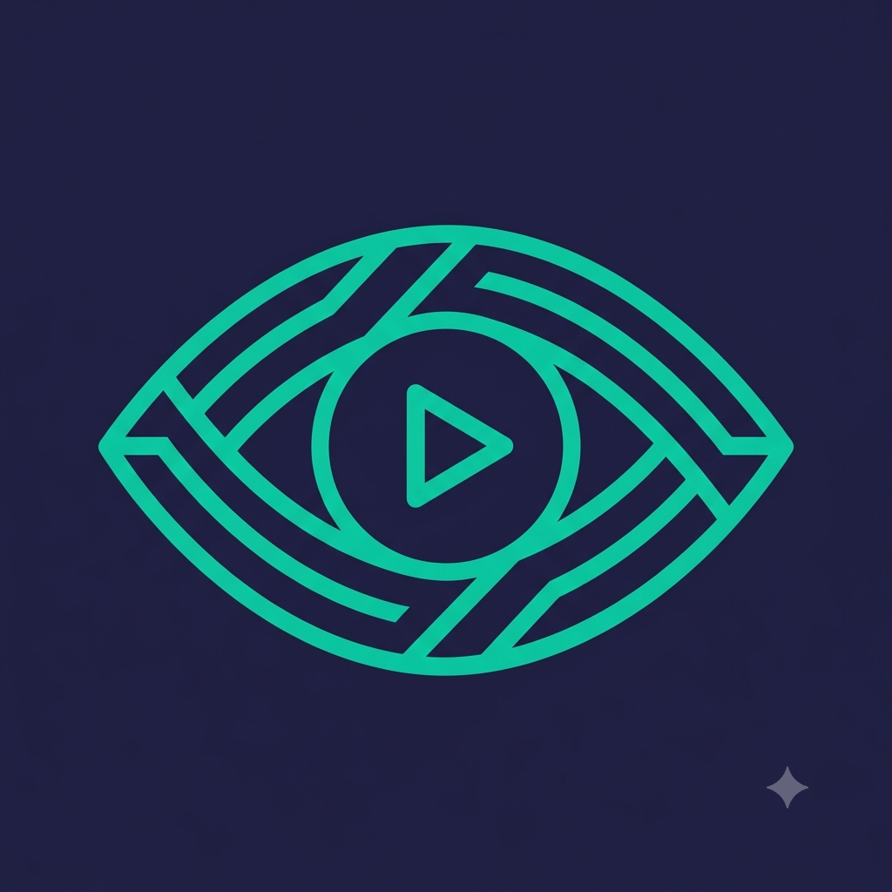

# Iris

<p align="center">
  
</p>

<p align="center">
  <strong>See the grind. Automate it.</strong>
</p>

<p align="center">
  <a href="https://github.com/rarebinary/IrisAI/actions"></a>
  <a href="https://github.com/rarebinary/IrisAI/releases"></a>
  <a href="https://github.com/rarebinary/IrisAI/blob/main/LICENSE"></a>
  <a href="https://github.com/rarebinary/IrisAI/stargazers"></a>
</p>

---

**Iris** is a local-first automation assistant for **Brawl Stars**. It runs on your PC, connects to any Android emulator via ADB, and uses computer vision (YOLO/ONNX) to play matches — farming trophies, gems, battle pass progress, brawler mastery, and star drops while you're AFK.

No memory injection. No game modification. No cloud dependency. Just pure computer vision + human-like ADB inputs.

> Based on the original [PylaAI](https://github.com/PylaAI/PylaAI/) (Windows-only) — rearchitected for macOS, stability, and distribution.

---

## Why Iris?

| Feature | What it means for you |
|---------|----------------------|
| 👁️ **Pure Computer Vision** | YOLOv8/ONNX models run 100% locally on your GPU/CPU — zero frames leave your machine |
| 🤖 **Human-Like Input** | ADB touch events with configurable jitter, reaction delays, imperfect paths, micro-pauses |
| 🔒 **Zero Injection** | Reads pixels, sends taps — never touches game memory, never hooks functions |
| 📦 **Multi-Account Fleet** | Orchestrate 10+ emulators/accounts from a single dashboard with per-account configs |
| 🌐 **Local Web UI + Discord Bot** | Monitor, schedule, pause, resume, and receive notifications from anywhere |
| ♻️ **Self-Healing** | Auto-reconnect on disconnect, crash recovery, model fallback (GPU→CPU), config validation |
| ⚡ **One-Command Install** | `python install.py` detects your hardware, pulls models, configures ADB, creates `.env` |
| 📦 **Standalone Builds** | `python build_nuitka.py` → native `.app` (macOS) / `.exe` (Windows) — runs on clean machines |

---

## Platform Support

| Platform | Status | Acceleration | Notes |
|----------|--------|--------------|-------|
| **macOS Apple Silicon (M1/M2/M3/M4)** | ✅ **Primary** | CoreML (ONNX Runtime Silicon) + MPS (PyTorch) | Best experience — native ARM, optimized for BlueStacks 5.21+ / MuMu / LDPlayer |
| **macOS Intel** | ✅ Supported | CPU / DirectML (via Windows VM) | Works via Rosetta 2 or Parallels |
| **Windows 10/11** | ✅ Supported | CUDA (NVIDIA) / DirectML (AMD/Intel) / CPU | LDPlayer, BlueStacks, MuMu, Nox all supported |
| **Linux (Ubuntu 22.04+ / Arch / Fedora)** | ⚠️ Experimental | CUDA / CPU | Requires Wayland/X11 ADB setup; community tested |

> **Emulators tested:** BlueStacks 5/10, LDPlayer 9/10, MuMu Player 12, Nox 7 — all work out of the box with default ADB ports.

---

## Quick Start (5 minutes)

### Prerequisites
- **Python 3.11+** (3.11.9 recommended)
- **Android emulator** with ADB enabled (BlueStacks: Settings → Advanced → Android Debug Bridge)
- **Brawl Stars installed** in the emulator
- **Git** (for updates)

### 1. Clone & Install
```bash
git clone https://github.com/rarebinary/IrisAI.git
cd IrisAI

# One-shot installer: detects GPU, installs deps, downloads models, verifies ADB, creates .env
python install.py
```

> **What `install.py` does:**
> - Detects platform (macOS ARM/Intel, Windows, Linux) and GPU (Metal, CUDA, DirectML, CPU)
> - Installs correct PyTorch + ONNX Runtime variant via `setup.py` extras
> - Downloads YOLO models from GitHub Releases (verifies SHA256)
> - Checks ADB in PATH, guides you if missing
> - Creates `.env` template with `IRIS_*` variables

### 2. Configure Secrets
```bash
cp .env.example .env
# Edit .env with your tokens (Discord bot token, user ID, guild ID, etc.)
```

### 3. Run
```bash
# macOS: double-click run.command  (creates venv, activates, loads .env, launches)
# Or anywhere:
python main.py
```

The Web UI opens at `http://localhost:<port>` (port shown in terminal).

---

## Commands

| Command | Description |
|---------|-------------|
| `python main.py` | Launch bot + Web UI + Discord bot |
| `./run.command` | macOS launcher (double-clickable, keeps terminal open on error) |
| `iris self-update` | `git pull` + `pip install -e .` + model update + restart |
| `iris update-models` | Re-download ONNX models only (fixes corrupted downloads) |
| `python build_nuitka.py` | Build standalone `.app` (macOS) / `.exe` (Windows) |
| `python install.py --cpu` | Force CPU-only install (no GPU deps) |
| `python install.py --coreml` | Force CoreML (Apple Silicon) |
| `python install.py --cuda` | Force CUDA (NVIDIA) |
| `python install.py --dev` | Editable install (`pip install -e .`) |

> After `pip install -e .`, the `iris` command is available globally.

---

## Configuration

Iris uses **`.env` (priority) → `cfg/*.toml` → defaults**. All settings documented in [CONFIG_REFERENCE.md](CONFIG_REFERENCE.md).

### Required (Discord Bot)
```bash
# .env
IRIS_DISCORD_BOT_TOKEN=your_bot_token_here
IRIS_DISCORD_USER_ID=your_discord_user_id
IRIS_DISCORD_GUILD_ID=your_server_id
```

### Optional
```bash
# Telegram notifications
IRIS_TELEGRAM_BOT_TOKEN=
IRIS_TELEGRAM_CHAT_ID=

# Cloud API (if you run your own backend)
IRIS_API_KEY=
IRIS_API_BASE_URL=https://api.iris.example.com
```

### Key TOML Files
| File | Purpose |
|------|---------|
| `cfg/bot_config.toml` | Playstyle, combat thresholds, movement delays |
| `cfg/general_config.toml` | Emulator port, max IPS, OCR scale, thread count |
| `cfg/webhook_config.toml` | Discord/Telegram ping triggers |
| `cfg/time_tresholds.toml` | State machine timeouts |
| `cfg/buttons_config.toml` | UI element coordinates (relative %) |

---

## Playstyles (`.iris` Scripts)

Behavior is defined in **Python scripts** executed safely via sandboxed `exec()`. Set active playstyle in `cfg/bot_config.toml`:

```toml
current_playstyle = "yann-universal.iris"
```

### Built-in Playstyles
| File | Description |
|------|-------------|
| `default_up.iris` | Moves UP when no enemies, basic combat |
| `default_right.iris` | Moves RIGHT when no enemies, basic combat |
| `follower.iris` | Follows nearest teammate |
| `showdown_survivor.iris` | Avoids gas, moves to center, follows teammates |
| `team_showdown.iris` | Duo Showdown coordination |
| `knockout.iris` | Knockout-specific positioning |
| `universal_smart_v5_*.iris` | Advanced: archetype-based combat (ASSASSIN/TANK/SNIPER/LOBS/RANGED), wall-aware, ability usage, gas avoidance |
| `yann-universal.iris` | Community favorite — balanced all-modes |
| `skeleton.py` | **Reference template** — all context variables + function signatures |

### Creating Your Own
1. Copy `playstyles/skeleton.py` → `playstyles/my_style.iris`
2. Edit the `run(context)` function — full game state available:
```python
context = {
    'enemies': [...],           # list of {pos, hp, brawler, dist}
    'teammates': [...],
    'walls': [...],             # wall/bush polygons
    'my_pos': (x, y),
    'my_hp': 0.85,
    'my_super': True,
    'my_gadget': True,
    'gamemode': 'gem_grab',
    'map_name': 'Double Swoosh',
    'time_remaining': 120,
    'gem_count': {'us': 8, 'them': 4},
    # ... 40+ more variables
}
```
3. Select in Web UI → Playstyles → Activate

---

## Web UI Features

- **Dashboard** — Live match view, trophy graphs, win/loss stats
- **Queue Manager** — Drag-drop brawler priority, play order (in_order / lowest_to_highest / highest_to_lowest)
- **Playstyle Editor** — Upload, edit, test `.iris` files with syntax highlighting
- **Settings** — All TOML configs exposed with validation + tooltips
- **Logs** — Real-time structured logs with filtering
- **Discord Control** — Slash commands: `/start`, `/pause`, `/stop`, `/status`, `/queue`, `/playstyle`

---

## Discord Bot Commands

| Command | Description |
|---------|-------------|
| `/start` | Start the bot (if queue configured) |
| `/pause` | Pause in lobby (finishes current match) |
| `/stop` | Stop gracefully (saves state, closes cleanly) |
| `/status` | Current match, trophies, queue progress |
| `/queue` | View/edit brawler queue |
| `/playstyle` | Switch active playstyle |
| `/logs` | Recent errors/warnings |
| `/screenshot` | Live emulator screenshot |

---

## Architecture Overview

```
┌─────────────┐     ADB      ┌──────────────┐
│   Iris      │◄────────────►│  Emulator    │
│  (Python)   │  touch/key   │  (BlueStacks │
│             │  events      │   / LDPlayer)│
└──────┬──────┘              └──────────────┘
       │
       ▼
┌─────────────┐     frames    ┌──────────────┐
│ scrcpy      │──────────────►│  Computer    │
│  (video)    │  (raw h264)   │  Vision      │
└─────────────┘               │  (YOLO/ONNX) │
                              └──────┬───────┘
                                     ▼
                          ┌──────────────────┐
                          │  Playstyle       │
                          │  (.iris script)  │
                          └────────┬─────────┘
                                   ▼
                          ┌──────────────────┐
                          │  ADB Commands    │
                          │  (move, attack,  │
                          │   super, gadget) │
                          └──────────────────┘
```

**Core Modules:**
- `main.py` — Entry point, `iris_main()` orchestrator
- `window_controller.py` — ADB connection, screen capture, input sending, resolution detection
- `detect.py` — ONNX inference (entities, walls, tiles)
- `state_finder.py` — Template matching for UI states (lobby, match, results)
- `play.py` — Game loop, playstyle execution, movement logic
- `stage_manager.py` — High-level state machine (lobby → match → results → repeat)
- `lobby_automation.py` — Brawler selection, play again, reconnect logic
- `trophy_observer.py` — Match history, CSV logging, trophy tracking
- `webui/` — Flask + Discord bot + REST API
- `config_loader.py` — Safe config with defaults + env override
- `network.py` — HTTP with timeout/retry (no more hanging requests)
- `threading_utils.py` — Thread-safe primitives (RLock, AtomicBool, ThreadSafeDict)

---

## Building Standalone App

```bash
# macOS
pip install nuitka
python build_nuitka.py
# → dist/IrisAI.app (double-click to run, no Python needed)

# Windows (cross-compile not supported — build on Windows)
pip install nuitka
python build_nuitka.py
# → dist/IrisAI.exe
```

The build includes: ONNX Runtime, EasyOCR, Flask, discord.py, pandas, av, adbutils, all `cfg/`, `images/`, `playstyles/`, `models/`, `templates/`, `static/`, `sounds/`.

---

## Troubleshooting

| Issue | Fix |
|-------|-----|
| `ADB not found` | `brew install android-platform-tools` (macOS) / Download platform-tools (Windows) / `sudo apt install android-tools-adb` (Linux) |
| `Model download failed` | Run `iris update-models` — retries with fresh manifest |
| `CUDA out of memory` | Lower `process_every_n_frames` in `general_config.toml` or use `--cpu` install |
| `Clicks offset on emulator` | Iris auto-detects resolution via `adb shell wm size` — ensure emulator is running before start |
| `Discord bot not responding` | Check `IRIS_DISCORD_BOT_TOKEN`, `IRIS_DISCORD_GUILD_ID`, bot has `applications.commands` scope |
| `Import error: onnxruntime` | Re-run `python install.py` — picks correct variant for your hardware |
| `Permission denied: run.command` | `chmod +x run.command` |

Full guide: [TROUBLESHOOTING.md](TROUBLESHOOTING.md)

---

## Updating

```bash
# Auto-update (git + pip + models)
iris self-update

# Or manually
git pull
pip install -e . --upgrade
iris update-models
```

---

## Contributing

1. Fork → feature branch → PR
2. Run `python -m py_compile $(find . -name "*.py" ! -path "./venv/*")` before committing
3. Follow existing code style (type hints, docstrings, structured logging)
4. Add tests for new playstyle context variables

### Code Standards
- **No `sys.exit()`** — use `RuntimeManager.request_stop()` + `mark_error()`/`mark_completed()`
- **All network calls** via `network.make_request()` (timeout + retry built-in)
- **All config access** via `config_loader.get_config()` (defaults + env override)
- **Shared state** protected by `threading_utils` primitives

---

## License

**MIT License** — see [LICENSE](LICENSE).

> Iris is an **automation assistant**, not a cheat. It does not modify game files, inject code, or bypass server-side checks. Use responsibly. Respect Supercell's Terms of Service. This project is for educational purposes.

---

## Credits

### Core Developers
- **@rarebinary** — Architecture, computer vision, stability rewrite, distribution pipeline

### Powered By
- [ONNX Runtime](https://onnxruntime.ai/) · [YOLOv8](https://github.com/ultralytics/ultralytics) · [OpenCV](https://opencv.org/) · [scrcpy](https://github.com/Genymobile/scrcpy) · [adbutils](https://github.com/openatx/adbutils) · [Flask](https://flask.palletsprojects.com/) · [discord.py](https://discordpy.readthedocs.io/) · [Nuitka](https://nuitka.net/) · [EasyOCR](https://github.com/JaidedAI/EasyOCR)

---

## Links

- 📖 **Docs**: [Getting Started](GETTING_STARTED.md) · [Config Reference](CONFIG_REFERENCE.md) · [Troubleshooting](TROUBLESHOOTING.md)
- 🐛 **Issues**: [GitHub Issues](https://github.com/rarebinary/IrisAI/issues)
- 🔧 **Releases**: [GitHub Releases](https://github.com/rarebinary/IrisAI/releases) — pre-built models, standalone apps

---

<p align="center">
  <sub>Built with ❤️ for the Brawl Stars community. Star ⭐ if Iris saves you time.</sub>
</p>